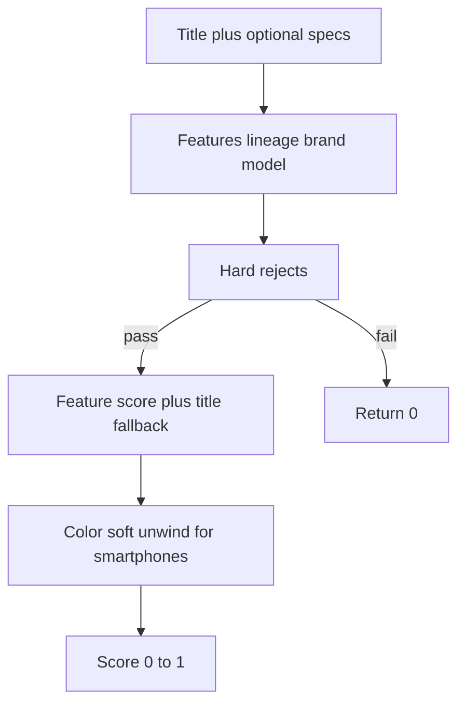

# Matching variant audit — PRODUCT IDENTITY vs VARIANT ATTRIBUTES

**Date:** 2026-08-26  
**Scope:** Read-only audit of client matching, Megamarket pipeline, and Edge compare-research.  
**Code changes:** none (audit only).  
**Trigger scenario:** Pixel 10 Obsidian 128GB vs Porcelain 128GB vs 256GB Obsidian vs Pixel 9 Obsidian — prefer same-model other color over different model.

---

## Executive verdict

**IMPLEMENT NOW** — incremental fix in the shared matching layer + Mega title/color signal.  
**Not** a full architecture rewrite.

### Why

| Already correct | Gap |
|-----------------|-----|
| Pixel 10 ≠ Pixel 9 → **hard reject** (`lineage-generation`) | Marketing colors **Obsidian / Porcelain / Indigo** not in color aliases → color never becomes structured soft preference |
| Pixel 10 128 ≠ 256 → **hard reject** (storage gate on phones) | Same-model color variants rank as near-ties via title tokens only |
| Accessory / case → **hard reject** (entity role + category) | Mega Product has no `color` / `storage` / `specs` fields — match is title-only |
| Smartphones profile: `soft: ['color']`, weight `color: 3` | Bare “Google Pixel …” may infer `generic` (no `\bpixel\b` in smartphones patterns) |

Desired priority:

```text
same model + same config + same color
  > same model + same config + different color   (SAME_PRODUCT_DIFFERENT_VARIANT)
  > same model + minor config difference
  > different model / generation / accessory
```

…is already enforced for **model/generation/storage**. Color preference needs **alias coverage + soft ranking**, not a new scorer or blind similarity bump.

---

## 1. Attribute extraction map

| # | Attribute | Primary code | Notes |
|---|-----------|--------------|--------|
| 1 | **Brand** | [`src/lib/model-extract.ts`](../src/lib/model-extract.ts) — `detectBrand`, `areBrandsCompatible` | Brand list includes `google`. Soft family groups (e.g. Xiaomi/Redmi). |
| 2 | **Model** | `extractProductModel` + `MODEL_PATTERNS` in `model-extract.ts` | Pixel: `google pixel N` / `pixel N` + optional pro/a/xl. |
| 3 | **Generation / family** | [`src/lib/lineage-generation.ts`](../src/lib/lineage-generation.ts) — `extractLineageGeneration`, `areLineageGenerationsCompatible` | Pixel → `{ lineage: 'pixel', gen, genKey }` (e.g. `10`, `9`, `10pro`). Missing on one side → compatible. |
| 4 | **Storage / capacity** | [`src/lib/attr-normalize.ts`](../src/lib/attr-normalize.ts) + `extractVariantAttributes` → [`product-features.ts`](../src/lib/product-features.ts) `extractProductFeatures` | Keys like `128gb`, `8+256`. |
| 5 | **Color** | `normalizeColor` / `extractNormalizedColor` (`attr-normalize`) + `COLOR_ALIASES` in `model-extract` | Common black/white/midnight… **No Obsidian / Porcelain / Indigo / Hazel.** |
| 6 | **Entity role** | [`src/lib/entity-extract.ts`](../src/lib/entity-extract.ts) + [`src/lib/match-rules/`](../src/lib/match-rules/) | Accessory/consumable ↔ host hard block. |
| 7 | **Category** | [`src/lib/category-plugins.ts`](../src/lib/category-plugins.ts) via `match-category.ts` | Smartphones need `смартфон` / `iphone` / `phone` / … — **not bare `pixel`**. |
| 8 | **GTIN / EAN** | Not extracted into match features today | Mega does not expose GTIN on Product. |
| 9 | **Similarity score** | [`src/lib/product-match.ts`](../src/lib/product-match.ts) — `scoreProductMatch` → `scoreFeatureMatch` + title fallback | Returns 0–1; confidence ≈ `round(score * 100)`. |
| 10 | **Final selection** | `pickTopMatchesWithScore` / `pickBestMatch*` → `buildOfferFromRankedCandidates` / `pickSearchFromCandidates` → `reorderPickerCandidates` / Mega `score > 0` | See §2. |

```94:112:src/lib/product-features.ts
export function extractProductFeatures(title: string, specs?: string): ProductFeatures {
  const info = extractProductModel(title);
  const variant = extractVariantAttributes(title, specs);
  // ...
  const storage = normalizeStorage(variant.storage) ?? extractNormalizedStorage(...) ?? variant.storage;
  const color = normalizeColor(variant.color) ?? extractNormalizedColor(...) ?? variant.color;
```

---

## 2. Scoring and candidate selection

### 2.1 `scoreProductMatch` pipeline



**Hard rejects (return 0), approximate order in [`product-match.ts`](../src/lib/product-match.ts):**

1. Empty / placeholder titles  
2. Category incompatible  
3. Entity role incompatible (accessory ↔ host)  
4. Compatibility-marker asymmetry  
5. **Lineage / generation** (Pixel 10 ≠ Pixel 9)  
6. Brand incompatible  
7. Model incompatible (except soft-model categories)  
8. **Storage** both present + disagree + `shouldPenalizeStorageMismatch` (phones, laptops, …)  
9. Connector / condition / authenticity / region / edition  
10. Package count / scent (detergents, cosmetics, pet_food)

**Soft path:** category profile weights → title similarity fallback → model boosts → `variantMismatchPenalty` with **color soft unwind** for smartphone-like profiles (`soft: ['color']`).

Smartphones profile ([`category-plugins.ts`](../src/lib/category-plugins.ts)):

- `required: ['brand', 'model']`
- `soft: ['color']`
- weights: brand 30, model 40, storage 20, **color 3**, title 20, …

### 2.2 Final candidate selection

| Function | Role |
|----------|------|
| `pickBestMatch` / `pickBestMatchWithScore` | Best above min score + price ratio |
| `pickTopMatchesWithScore` | Top-N; floor ≈ `minScore * 0.85` |
| `buildOfferFromRankedCandidates` | Category filter → reorder → AUTO_PICK or `needs_choice` |
| `pickSearchFromCandidates` | Lineage prefilter → rank → **Mega-only `score > 0`** → reorder |
| `reorderPickerCandidates` | Identity-compatible first; among close scores, cheapest |
| `tryUnambiguousSerpVerified` | AUTO_PICK ≥ 70, product URL, price, no close tie |

**Key constants** ([`product-match.ts`](../src/lib/product-match.ts)):

| Constant | Value |
|----------|-------|
| `MIN_COMPARE_MATCH_CONFIDENCE` | 55 |
| `AUTO_PICK_CONFIDENCE_THRESHOLD` | 70 |
| `DEFAULT_MIN_MATCH_SCORE` | 0.55 |
| `CLOSE_MATCH_TIE_DELTA` | 5 |

### 2.3 Client vs Edge divergence

| Layer | Matcher | Mega |
|-------|---------|------|
| **Client** | Shared `scoreProductMatch` | Tab SERP + Mega `score > 0` filter |
| **Edge `compare-research`** | Separate `scoreTitle` token overlap in [`marketplace-search-core.ts`](../supabase/functions/_shared/marketplace-search-core.ts) | **Not in targets** (trio only) |
| **product-intel / Scrappey** | Price/intel, not SKU match | Mega unlocker/monitoring off |

There is **no** duplicated `scoreProductMatch` under `supabase/functions`. Unifying Edge to the client attribute matcher is out of scope for the color-variant fix.

---

## 3. Scenario: current engine behavior

**Reference:** `Смартфон Google Pixel 10 Obsidian 128GB` (category `smartphones`).

| Candidate | Expected score | Why |
|-----------|----------------|-----|
| Pixel 10 Obsidian 128 | High (~AUTO_PICK) | Same lineage/model/storage; Obsidian often **unextracted** |
| Pixel 10 Porcelain 128 | High, near-tie | Same hard identity; color soft / usually unknown; tiny title gap |
| Pixel 10 Obsidian 256 | **0** | Storage hard gate |
| Pixel 9 Obsidian 128 | **0** | Lineage genKey `10` ≠ `9` |

**Likely ranking among survivors:** Obsidian 128 ≳ Porcelain 128 (title tokens only).  
**256 and Pixel 9 never compete** on Mega (`score > 0` filter). On CORE, soft `minScore: 0` can still surface score-0 junk in a weak pool (intentional after Mega-only hardening).

User goal for Obsidian ≻ Porcelain needs **extractable marketing colors + soft preference when identity equal** — not raising global similarity.

---

## 4. Proposed conceptual model

### PRODUCT IDENTITY (hard)

Strong signals that define “same product configuration / SKU class”:

- brand  
- product family / lineage  
- exact model + tier (Pro / a / XL)  
- generation  
- model number (when present)  
- GTIN/EAN (when present — **not used today**)  
- storage / capacity (category-dependent)  
- screen size / processor / other category-specific hard attrs (via plugins)

Mismatch on identity → **score 0 / reject / do not auto-pick**.

### VARIANT ATTRIBUTES (soft)

- color / finish / pattern / minor cosmetic  

Same identity + different variant → `SAME_PRODUCT_DIFFERENT_VARIANT`:

- Prefer exact color when both extracted  
- Allow other color as **fallback** (search + picker)  
- Small penalty only — **never** prefer different generation/model over wrong color  

### Explicit SKU rules (electronics)

| Pair | Classification |
|------|----------------|
| Pixel 10 128 black vs Pixel 10 128 white | SAME_PRODUCT_DIFFERENT_VARIANT |
| Pixel 10 128 black vs Pixel 10 256 black | **Different SKU** (storage hard) |
| Pixel 10 vs Pixel 9 | **Different product** (generation hard) |
| Pixel 10 vs Pixel 10 Pro | **Different product** (tier / genKey) |
| Pixel 10 vs Pixel 10 case | **Hard reject** (accessory) |

### Proposed ranking layers (aligned with existing architecture)

Do **not** invent a second scorer. Prefer:

1. Exact model identity (lineage + model) — hard  
2. Generation / tier — hard  
3. Configuration (storage, RAM where required) — hard for phones  
4. Brand — hard  
5. Category / entity role — hard  
6. **Color** — soft preference among identity-equal survivors  
7. Title similarity — fallback / tie-break  
8. Price — tie-break among close matches (`reorderPickerCandidates`)

Weights already encode most of this; the missing piece is **color extraction + soft preference signal**.

---

## 5. Per-category hard vs soft (mapped to existing plugins)

Repo categories use ids like `smartphones`, `headphones`, `laptops`, `tvs`, `appliances`, `cosmetics`, `apparel`. Below maps the audit’s requested labels onto current behavior.

### Smartphone (`smartphones`)

| Hard identity | Soft variant | Dangerous mismatches |
|---------------|--------------|----------------------|
| brand, model, lineage/gen, storage, region/SIM when both explicit, condition | color | Wrong gen (9 vs 10), Pro vs base, 128 vs 256, case/cable as phone |

### Headphones (`headphones`)

| Hard | Soft | Dangerous |
|------|------|-----------|
| brand, model, lineage (Buds gen), connector when both set | color, some storage soft in accessories-adjacent profiles | Buds 5 vs 6, phone title as “match”, wrong connector |

### Laptop (`laptops`)

| Hard | Soft | Dangerous |
|------|------|-----------|
| brand, model, storage (penalized), CPU/RAM signals in title features | color | GPU/desktop/monoblock cross-category, stencil/accessory |

### TV (`tvs`) / monitors

| Hard | Soft | Dangerous |
|------|------|-----------|
| brand, model/series, size often in title | color | TV vs accessory, monitor vs TV when both non-generic |

### Vacuum / appliances (`appliances`)

| Hard | Soft | Dangerous |
|------|------|-----------|
| brand, model series | color, volume, weight | Cross-category tools vs appliance |

### Cosmetics (`cosmetics`)

| Hard | Soft | Dangerous |
|------|------|-----------|
| brand; scent often hard-conflict when both set | size | Wrong scent as soft-only would be dangerous — keep scent hard |

### Clothing (`apparel` / `shoes`)

| Hard | Soft | Dangerous |
|------|------|-----------|
| brand (required) | **size**, color, model soft | Treating size as hard identity for listings; color often soft — **do not** copy phone storage rules |

### Other (`generic` / `home_goods` / grocery)

| Hard | Soft | Dangerous |
|------|------|-----------|
| brand when detectable; category vs electronics | color often not soft on generic (`soft: []`) | Furniture/food vs electronics (Mega junk) — Mega `score > 0` + grocery/home_goods plugins |

**Do not** apply a universal “model equal ⇒ same SKU” rule — it would break phone storage and cosmetics scent.

---

## 6. Megamarket investigation

### 6.1 Card parser fields (facts only)

[`parseMegamarketProduct`](../src/utils/parsers/megamarket.ts) returns:

| Field | Set? |
|-------|------|
| `id`, `marketplace`, `title`, `price`, `currency` | Yes |
| `article`, `url` (canonical), `imageUrl`, `scrapedAt` | Yes |
| `availability` | Yes (OOS / in_stock / undefined) |
| `brand` (Product field) | **No** — brand only prepended into `title` via `titleWithBrand` |
| `color` | **No** |
| `storage` | **N/A** on Product type as dedicated field |
| `specs` | **No** on Product |
| `rating` / `reviewCount` | **No** |
| GTIN / EAN | **Not available** in parser |

Seller: [`content/index.ts`](../src/content/index.ts) → `scrapeMegamarketSellerFromDom` → `pageMeta.specs` (`Продавец: …`), not Product.specs for matching.

### 6.2 SERP

[`scrapeMegamarketCandidates`](../src/utils/parsers/search-results.ts): tile title via `pickSerpTitleFromTile` (no query-as-title), price via `parseRubPrices`, URL canonical details + article required.  
After rank: **Mega-only** keep `isTitleCategoryCompatible` ∧ `scoreProductMatch > 0` (stops furniture/food/wrong storage as «похожие»).

### 6.3 Why Mega feels worse on partial match

1. No search API — tab SERP only (`searchMegamarket` stub).  
2. Thin card attributes — color/storage only if present in **title** string.  
3. No Edge compare-research / Scrappey verify for Mega.  
4. Noisy SERP pages (recommendations) — mitigated by Mega `score > 0`, which can yield `not_found` instead of junk picker.  
5. Marketing color names unextracted → cannot prefer Obsidian over Porcelain structurally.

---

## 7. Search pipeline note

Query: `Pixel 10 128GB Obsidian` may return SERP tiles titled Porcelain — **acceptable fallback** after identity match.  

Must **not** accept via high title similarity alone:

- Pixel 9  
- Pixel 10 Pro (different genKey/tier)  
- Pixel 10 case  

Current hard gates already cover these when titles parse; Mega filter drops score 0. Remaining work is soft color ranking among identity-equal hits.

---

## 8. Minimal implementation plan (do not implement in this audit)

### A. Shared matching engine

1. Add marketing color aliases to **both** [`attr-normalize.ts`](../src/lib/attr-normalize.ts) and [`model-extract.ts`](../src/lib/model-extract.ts): Obsidian→black (or dedicated family), Porcelain→white, Indigo→blue/purple, Hazel, etc.  
2. Keep storage/model/lineage hard rejects unchanged.  
3. Soft preference: when identity equal (lineage + model + storage), boost exact color match / small penalty for color mismatch (existing soft color path + optional reorder tie-break).  
4. Optional: add `\bpixel\b` to smartphones `inferPatterns` so bare Pixel titles are not `generic`.  
5. **Do not** raise global title similarity to “fix” color.

### B. Megamarket parser

1. Optionally set `Product.color` from `extractProductFeatures(title).color` (parity with Ozon/WB) — still title-derived, no invented GTIN.  
2. Do not invent specs/SKU APIs.  
3. Keep SERP no-query-title + Mega `score > 0` filter.

### C. Server Edge Functions

1. **No change required** for Mega color ranking (Mega not in compare-research).  
2. Do not port `scoreTitle` to Mega.  
3. Later (separate RFC): align Edge `scoreTitle` with client identity gates for trio only.

### D. Client

1. Shared engine changes apply automatically to Mega compare.  
2. Mega-only junk filter stays.  
3. Optional: `reorderPickerCandidates` prefer color match among identity-compatible close scores (only if soft score delta insufficient).

### E. Tests

1. Obsidian vs Porcelain same 128 → both score > 0; Obsidian ranks above Porcelain when colors extracted.  
2. 256 and Pixel 9 stay score 0.  
3. Case/accessory stay reject.  
4. Apparel/cosmetics: color soft/hard regression (do not make clothing size hard like phone storage).  
5. Mega SERP fixture: furniture + wrong storage filtered; same-storage other color kept.

---

## 9. Files reviewed

| Area | Paths |
|------|--------|
| Match core | `product-match.ts`, `product-features.ts`, `attr-normalize.ts`, `model-extract.ts`, `lineage-generation.ts`, `entity-extract.ts`, `match-category.ts`, `category-plugins.ts`, `match-rules/` |
| Selection | `match-status.ts`, `serp-auto-pick.ts`, `search-offer-from-candidates.ts`, `search-results.ts` |
| Mega | `parsers/megamarket.ts`, `content/index.ts`, `marketplace-search.ts` (`searchMegamarket`) |
| Edge | `supabase/functions/_shared/marketplace-search-core.ts`, `compare-research/index.ts` |
| Tests | `mega-serp-match.test.ts`, category/accessory reject tests, `attr-normalize.test.ts` |

**Not found as named in the request:** `marketplace-search-core.ts` lives under Supabase shared (not `src/`). Client orchestration is `marketplace-search.ts`.

---

## 10. Recommendation

# IMPLEMENT NOW

**Why:** Architecture already separates hard identity (lineage, model, storage, role) from soft color. The user-visible failure mode (cannot prefer Obsidian over Porcelain; Mega noisy partials) is explained by **missing color aliases + thin Mega titles**, not by absence of an identity model.

**Why not “REQUIRES ARCHITECTURE CHANGE”:** A new PRODUCT_IDENTITY subsystem / Edge unification would be large, high-risk for clothing/cosmetics, and unnecessary to ship the Pixel color-fallback behavior. Do identity/variant **documentation + alias/soft preference** first; revisit Edge parity only if trio server research shows the same color gap.

**Out of scope for first impl PR:** GTIN matching, Mega Scrappey/compare-research, raising global similarity, reverting Mega `score > 0` filter.
