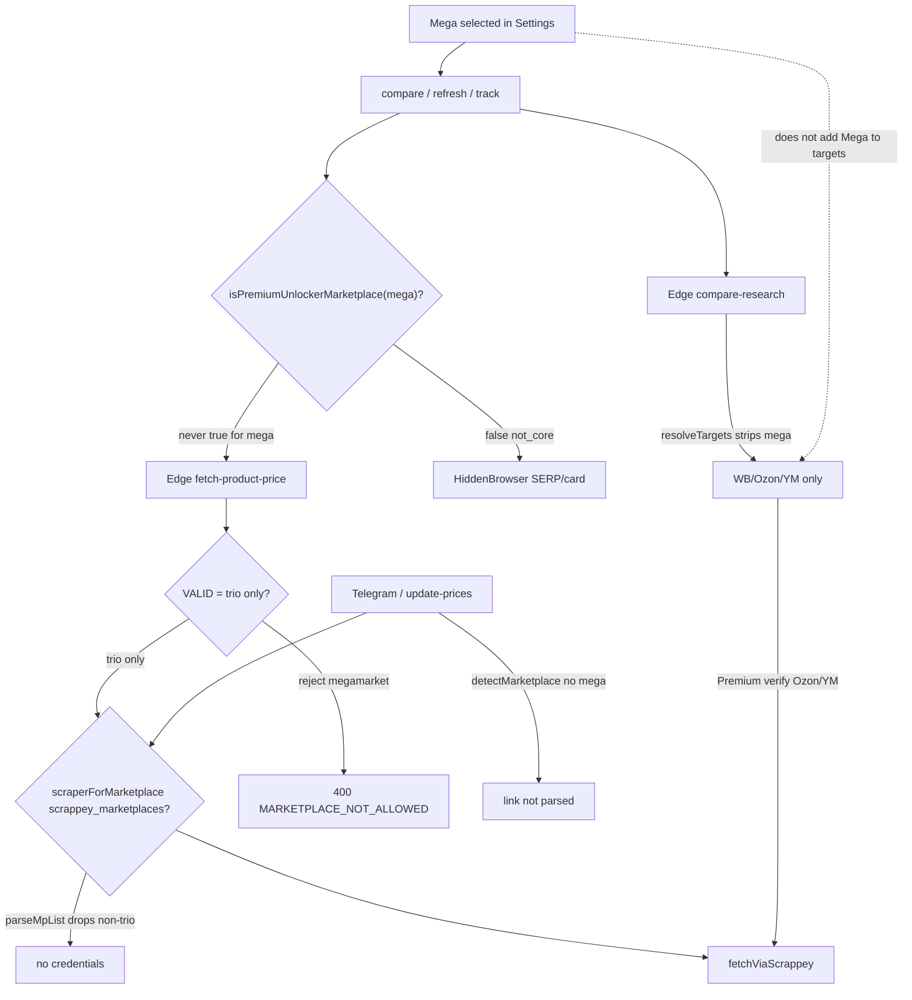

# STEP 4 — Scrappey cost audit (Megamarket)

**Date:** 2026-08-26  
**Scope:** Trace **all** client + Edge paths where selecting / using MegaMarket could touch Scrappey, unlocker, SERP, HiddenBrowser, `fetch-product-price`, `compare-research`, tracked refresh, Telegram.  
**No code changes.**

---

## Defense layers (Mega → Scrappey)



**Key invariant:** Selecting Mega does **not** open a Scrappey call for Mega. CORE Scrappey (Ozon/YM unlocker / research verify / TG monitoring) can still run for **CORE** MPs in the same session — that is independent of Mega.

---

## Master table

| PATH | Mega selected | Scrappey? | Expected? | Actual (code) | Risk |
|------|---------------|-----------|-----------|---------------|------|
| **1. Ordinary compare** — `compareProductAcrossMarketplaces` → Mega target | Yes | **No** for Mega | Yes | API stub → HiddenBrowser SERP → `product-match` → card cascade via tab; unlocker skipped (`not_core`) | Low $; HB cost only |
| **1b. Same compare** — CORE targets in same run | Yes (Mega also on) | **Maybe** for Ozon/YM | Yes (CORE) | Edge research verify / Premium unlocker for trio only | Medium $ — **not caused by Mega**; same as pre-Mega |
| **2. Refresh** — `fetchOfferWithFallback(url, megamarket)` | Yes / bound Mega URL | **No** | Yes | `fetchOfferViaApi` null → HB card → unlocker gate false | Low |
| **3. Tracked product** — client `checkTrackedProduct` | Mega tracked locally | **No** | Yes | `fetchOfferFromUrl(..., { skipUnlocker: true })` → HB/API only | Low |
| **3b. Tracked** — server `update-prices` cron | Mega row in DB (if CHECK allows) | **No** | Yes | `resolveMonitoringKey` returns **null** for non-core → coalesce **drops** row (no Scrappey job) | Low; Mega not monitored |
| **4. compare-research** Edge | Client may send Mega in `targetMarketplaces` | **No for Mega** | Yes | `resolveTargets` = VALID ∩ request → Mega **stripped**; Scrappey only Premium top-1 verify on Ozon/YM | Low for Mega; CORE verify unchanged |
| **5. Retry / pick-retry / re-research Mega slot** | Yes | **No** for Mega | Yes | Same unlocker + VALID gates; retries re-enter tab/HB paths | Low |
| **6. Failed parser / empty Mega card** | Yes | **No** | Yes | `noteEmptyScrape` → skip tab budget; unlocker **not** entered for Mega | Low; may leave not_found |
| **7. Cache miss** — Mega card/SERP | Yes | **No** | Yes | No Mega writes to `price_scrape_cache` (trio CHECK + no server Mega fetch); miss → HB, not Scrappey | Low |
| **7b. Cache miss** — CORE unlocker | N/A | Yes if Premium+selected | Yes | Shared cache then Scrappey — unrelated to Mega | — |
| **8. Multiple MPs** (Mega+WB+Ozon+YM) | Yes | Scrappey **only** for allowed CORE paths | Yes | Mega tab; CORE may unlocker/research-verify | Selecting Mega **does not multiply** Scrappey beyond CORE |
| **9. Telegram `/add` Mega URL** | N/A | **No** | Yes | `detectMarketplace` Edge = trio only → link **not recognized** | None |
| **9b. Telegram monitoring cron** | monitoring_enabled Mega false | **No** | Yes | Flag + `isCoreMonitoringMarketplace` + `parseMpList` | None |
| **9c. product-intel** on pasted Mega link | N/A | **No** | Yes | Never reaches intel (parse fails first) | None |
| **Client Premium unlocker** `fetchOfferViaPremiumUnlocker('megamarket')` | Yes | **No** (no Edge call) | Yes | `assertPremiumUnlockerAllowed` → `not_core` → return null **before** `callEdgeSafe` | None |
| **Edge `fetch-product-price`** forged body `marketplace=megamarket` | Attack/bug | **No** | Yes | `VALID.includes` fails → 400 before `scraperForMarketplace` | None |
| **Edge `scraperForMarketplace('megamarket')`** | If somehow reached | **No** | Yes | `parseMpList` / allowlist = CORE only → null credentials | None |
| **SEO publish / agent-orchestrator** | — | **No** Mega Scrappey | Yes | SEO no Scrappey for Mega; agent `ALL_MARKETPLACES` = trio | None |
| **HiddenBrowser SERP/card** Mega | Yes | N/A (not Scrappey) | Yes | Expected tab-tier cost | Resource/UX, not Scrappey $ |
| **search_metrics / telemetry** Mega | Yes | No | Yes | Metrics only; may hit DB CHECK on `search_metrics` (trio) — not Scrappey | P3 ops noise |

---

## Scenario deep-dives

### 1. Ordinary compare (Mega selected)

**Call path:**  
`compare-service` → `marketplace-search.compareProductAcrossMarketplaces` → for Mega: mapping miss → Edge research (Mega stripped from results) → `searchMarketplaceWithFallback('megamarket')` → SERP cache? → HiddenBrowser / visible SERP → `scrapeMegamarketCandidates` → match → optional `verifySerpOfferWithCardCascade` → `fetchOfferWithFallback` (tab).

**Scrappey:** not invoked for Mega.  
**Unlocker:** `isPremiumUnlockerMarketplace` false.  
**Cost:** Chrome tab time only.

### 2. Refresh

**Call path:** `product-page-fetch.fetchOfferWithFallback` → API null → HB → unlocker skipped.  
**Scrappey:** No.

### 3. Tracked product

| Layer | Behavior |
|-------|----------|
| Client alarm backup | `skipUnlocker: true` always on tracked check |
| Server cron | Non-core keys dropped in `resolveMonitoringKey` / coalesce |

Even if Mega row exists in `tracked_products` after migration, **cron will not Scrappey it**.

### 4. compare-research

Client may pass Mega in `targetMarketplaces`. Edge:

```ts
const VALID = ['wildberries','ozon','yandex_market'];
// resolveTargets = VALID ∩ requested  → megamarket never searched
```

Premium Scrappey verify applies only to Ozon/YM (and WB without Scrappey). **Selecting Mega does not add a Mega Scrappey verify.**

### 5. Retry

Re-entry into same gates. No Mega-specific Scrappey bypass found.

### 6. Failed parser

Empty Mega card increments empty-scrape budget → skip further HB for that MP; does **not** escalate to unlocker (unlike CORE, which can).

### 7. Cache miss

Mega has no server scrape writer → miss ≠ Scrappey. Local SERP cache may fill after successful tab search (client-only).

### 8. Multiple marketplaces

Mega selection is additive for **tab** work only. Scrappey volume driven by CORE unlocker/research/TG — same formulas as without Mega.

### 9. Telegram-related

| Entry | Mega Scrappey? |
|-------|----------------|
| `/add` Mega URL | No — parse fails |
| `isMonitoringAllowed(megamarket)` | false (seed + defaults) |
| `update-prices` group marketplace=megamarket | Never formed (coalesce drop) |
| `scraperForMarketplace(..., 'megamarket')` | null |

---

## If Scrappey **were** called for Mega — what would it take?

All of the following would need to break (defense in depth):

1. Client: add Mega to `PREMIUM_UNLOCKER_MARKETPLACES` **and** pass unlocker gate.  
2. Edge: add Mega to `VALID` in `fetch-product-price` **and** implement `fetchMarketplacePriceDetailed` for Mega.  
3. Cost guards: change `parseMpList` / `CORE` to accept Mega in `scrappey_marketplaces`.  
4. Monitoring: `isCoreMonitoringMarketplace` + flags `monitoring_enabled` + Telegram detect.

**Today: none of these are true.** Accidental Mega Scrappey from “Mega selected” alone is **not** possible with current code.

---

## Cost estimate

| Event | Scrappey $ |
|-------|------------|
| User selects Mega | **$0** |
| Mega compare / refresh / failed parse / retry | **$0** Scrappey |
| Mega tracked (client or cron) | **$0** Scrappey |
| Mega Telegram link | **$0** (rejected) |
| Same session CORE Ozon unlocker (Premium) | Existing CORE cost (~4 ₽ / 1000 calls assumption) — **unchanged by Mega** |

---

## Residual risks (not Mega→Scrappey, but related)

| Risk | Severity | Note |
|------|----------|------|
| HiddenBrowser load when Mega selected | P2 | Real cost is user Chrome / rate limits, not Scrappey |
| Ops flips `monitoring_enabled=true` **and** widens CORE allowlists by mistake | P1 ops | Would require code+config changes beyond flag alone for Scrappey Mega |
| Forged client calls to unlocker with `marketplace=ozon` + wrong URL | Pre-existing | Not Mega-specific |
| `search_metrics` INSERT with megamarket may fail CHECK | P3 | No Scrappey |

---

## Verdicts (Step 4)

| Question | Answer |
|----------|--------|
| Does selecting Mega **automatically** cause Scrappey? | **NO** |
| **SCRAPPEY SAFE** (Mega-induced) | **YES** |
| Edge paths reviewed? | Yes (`fetch-product-price`, `compare-research`, `update-prices`, `telegram-webhook`, `cost-guards`, `marketplace-prices`, `product-intel`) |
| Client paths reviewed? | Yes (unlocker, product-page-fetch, marketplace-search, background tracked/compare backup) |

### Minimal fixes (none required for Scrappey Mega)

No code fix required for Mega→Scrappey. Optional hardening (P2, separate approval):

- Log/assert if `fetch-product-price` ever receives non-VALID (already 400).  
- Metrics: alert if ops telemetry ever shows `marketplace=megamarket` + `source=scrappey` (should be zero).

**Do not** enable Mega monitoring or add Mega to `scrappey_marketplaces` without a dedicated cost RFC.
